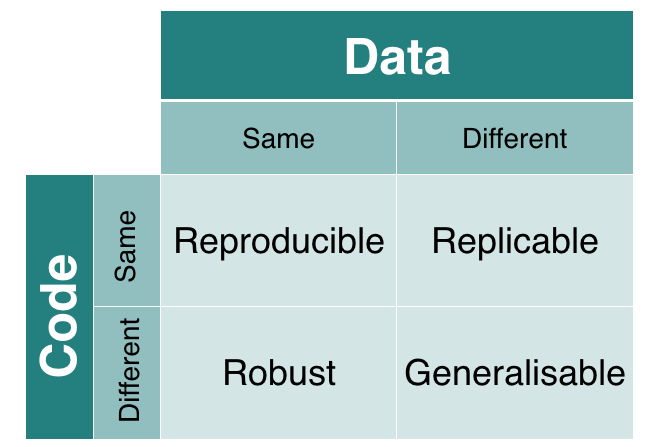

```{r setup, include=FALSE}
knitr::opts_chunk$set(echo = TRUE)
```

## Instructions:

In this R Markdown document, you and your team will create a fully reproducible analysis with the goal of assessing and interpreting the replicability of two pharmacogenomic experiments. This document should contain all of the text and code of your analyses, which will allow others to run, interpret, and reuse your work.

The questions below will help guide you in your analyses and interpretation of results. You don't need to answer every question, but for the problems you do complete, make sure that you completely justify your conclusions by explaining your reasoning and including numerical summaries and data visualizations wherever possible. There are four tutorials (also R Markdown documents) that will help you learn new tools to tackle these problems, and the questions are divided into four sections corresponding to the tutorials (though many overlap with more than one tutorial). If questions arise during your analyses that do not fit into these problems, feel free to include those as well. 

For each answer, include text by simply typing below the question. Include code in code blocks (include three back ticks at the start and end of each code block):

```{r}
#Your code goes here
library(tidyverse)
library(dplyr)
library(tidyr)
```

You may find it helpful to use the version control and code sharing system called GitHub to work together with your team so that all of you can edit the same document and keep track of its changes. Here is a [setup guide](https://github.com/datasciencelabs/2016/blob/master/lectures/git-and-github/setting-up-git.Rmd) and [brief introduction to Git and GitHub](https://github.com/datasciencelabs/2016/blob/master/lectures/git-and-github/version-control.Rmd) from another course. The mentors will be able to help if you run into problems. 

## Questions:

### Exploratory analysis of pharmacogenomic data
```{r}
rawFile <- "rawPharmacoData.csv"
if( !file.exists( rawFile ) ){
    source("downloadData.R")
}
pharmacoData <- read.csv(rawFile)
head(pharmacoData )
str(pharmacoData )
summary(pharmacoData)
```

1. How many cell-lines are contained in the data?
```{r}
length(levels(pharmacoData$cellLine ))
```
There are 288 cell lines contained in the data. 

2. What drug concentrations were used in each study?
```{r}
drugConcPerStudy <- select(pharmacoData, study, concentration, drug)
drugConcPerStudy

drugConcPerStudy %>%
    group_by(study, concentration, drug) %>%
    summarize(n())

allDrugConcPerStudy <- drugConcPerStudy %>%
    group_by(study, drug) %>%
    summarize(meanDrugConc=mean(concentration), maxDrugConc=max(concentration), minDrugConc=min(concentration), n())
allDrugConcPerStudy

summDrugConcPerStudy <- drugConcPerStudy %>%
    group_by(study) %>%
    summarize(meanDrugConc=mean(concentration), maxDrugConc=max(concentration), minDrugConc=min(concentration), concentration= n_distinct(concentration), drugTypes=n_distinct(drug), n())
summDrugConcPerStudy
```
For the CCLE and GDSC studies the drug concentrations used was 8 and 32, respectively.

3. Histograms, appart from telling how is the data
distributed, can also make evident potential
problems with the data. Plot a histogram
of drug viabilities. Does it look as one would
expect from the description of the data?

```{r}
pharmacoData %>%
    ggplot(aes(x = log2(viability))) +
    geom_histogram(fill = "gray", color = "black") +
    facet_wrap(~ drug) +
    ggtitle("Distributions of viability by drug")

pharmacoData %>%
    ggplot(aes(x = viability)) +
    geom_histogram(aes( color = study, binwidth = 0.1)) +
    facet_wrap(~ drug) +
    ggtitle("Distributions of viability by drug")
```
We expected the viability of each drug to be between 0 and 100. 

4. How many viability data points are within the
expected range according to the definition of viability (e.g. above 0 
and below 100)? Try to come up with explanations about
the values that are out of range. Are these due to technical
issues? Biology?
```{r}
pharmacoData %>%
    group_by(study)%>%
    summarize(min_viability = min(viability),
              max_viability = max(viability),
              n_too_small   = sum(viability < 0),
              n_too_big     = sum(viability > 100),
              n_middle      = sum(viability >0 & viability < 100))
```

5. Read the csv file containing the summarized data files. What kind
of variables are in the data? What does each column represents?
```{r}
summarizedPharmacoData <-read.csv("summarizedPharmacoData.csv")
str(summarizedPharmacoData)
#summarizedPharmacoData <-read.csv("summarizedPharmacoData.csv", header= TRUE)
#summarizedPharmacoData
#str(summarizedPharmacoData)
```
The kind of variables in the data are factors and numericals. For example, the variables cellline and drug are categorical variables. The variables ic50_CCLE, auc_CCLE, ic50_GDSC, and auc_GDSC are numericals. 

On the other hand, the column cellLine represents the different types of cells. The column drug represents the type of drug. The ic50_CCLE is the estimated concentration of the drug that results in 50% of cell survival in the CCLE study. While ic50_GDSC represents the estimated concentration of the drug that results in 50% of cell survival in the GDSC study. The auc_CCLE is the area above the curve, which is estimated by the drug concentration an viability in the CCLE study. Similarly, the auc_GDSC is the area above is the area above the curve, which is estimated by the drug concentration an viability in the GDSC study. 

6. Plot a histogram of the viability scores as a function of the drug
doses. Are stronger drug concentrations consistent with lower viability scores?

```{r}
ggplot(pharmacoData, aes(x = viability)) +
    geom_histogram(aes(color = drug, binwidth = 0.1)) +
    facet_wrap(~ concentration) +
    ggtitle("Viability Scores vs Drug Doses")
```


### Using Correlation Measures to Assess Replicability of Drug Response Studies

1. Create a scatterplot for each drug comparing the AUC in GDSC and CCLE for all cell lines (hint: code from Tutorial 2 may help).
```{r}
ggplot(summarizedPharmacoData, aes(x = auc_GDSC, y = auc_CCLE, col = drug)) +
    geom_jitter(alpha = 1/2) +
    xlab("GDSC AUC") +
    ylab("CCLE AUC") +
    ggtitle("Comparing AUC in GDSC and CCLE for all cell lines")
```

2. Calculate correlation coefficients of the AUC in GDSC and CCLE for each drug (hint: code from Tutorial 2 may help). 
```{r}
ggplot(summarizedPharmacoData, aes(x = auc_GDSC, y = auc_CCLE, col = drug)) +
    geom_jitter(alpha = 1/2) +
    xlab("GDSC AUC") +
    ylab("CCLE AUC") +
    facet_wrap(~ drug) +
    geom_smooth(method = "lm", col = "black") +
    ggtitle("Comparing AUC in GDSC and CCLE for all drugs")
```

3. Based on the scatterplot and correlation values, would you say that they tend to agree? Why or why not?
```{r}
drugCorrs <- summarizedPharmacoData %>% 
    group_by(drug) %>%
    summarize(Pearson_ic50  = cor(-log10(ic50_GDSC / 10^6), -log10(ic50_CCLE / 10^6), method = "pearson"), Spearman_ic50 = cor(-log10(ic50_GDSC / 10^6), -log10(ic50_CCLE / 10^6), method = "spearman"))

drugCorrs <- gather(drugCorrs, measure, correlation, -drug)

drugCorrs

drugCorrs %>%
  tidyr::spread(measure, correlation) %>%
  ggplot(aes(x = Pearson_ic50, y = Spearman_ic50, label = drug)) +
    geom_point(alpha = 1/2) +
    geom_text() +
    ggtitle("Correlation of cell line IC50 summaries between studies for each drug")


drugCorrs

drugCorrs %>%
    ggplot(aes(x = drug, y = correlation, fill = measure, group = measure)) +
    geom_bar(stat = "identity", position = position_dodge(), colour = "black") + 
    theme(axis.text.x = element_text(angle = 45, hjust = 1)) +
    scale_fill_grey() +
    ylim(0, 1) + 
    ggtitle("Correlation of cell line IC50 summaries between studies for each drug")


```

4. Does the AUC or IC50 suggest more agreement between the studies? 
```{r}
library(ggplot2)
ggplot(aes(x=auc_GDSC, y=auc_CCLE), data=subset(summarizedPharmacoData, drug=="AZD0530")) +
    geom_point() +
    xlab("GDSC AUC") +
    ylab("CCLE AUC") 
```

```{r}
set.seed(920)
cor.coef <- round(cor(cellLinesSummary$auc_CCLE, cellLinesSummary$auc_GDSC),2)
ggplot(data=cellLinesSummary, aes(x=auc_GDSC,y=auc_CCLE)) +
  geom_point() +
  ggtitle(paste0("Correlation coefficient = ", cor.coef)) + 
  geom_smooth(method='lm', se=FALSE) +theme(plot.title = element_text(hjust = 0.5))
```
```{r}
set.seed(920)
cor.coef <- round(cor(cellLinesSummary$ic50_CCLE, cellLinesSummary$ic50_GDSC),2)
ggplot(data=cellLinesSummary, aes(x=-log10(ic50_GDSC),y=-log10(ic50_CCLE))) +
  geom_point() +
  ggtitle(paste0("Correlation coefficient = ", cor.coef)) + 
  geom_smooth(method='lm', se=FALSE) +theme(plot.title = element_text(hjust = 0.5))
```

There is more agreement in the AUC because its correlation coefficient is 0.67, which is considered strong, while the correlation coefficient of the IC50 is weaker: 0.31. 

5. Which drug do you think shows the most consistency between the studies? How about the least?  


```{r}
mcc <- function (study1, study2)
{
  BS <- sum(study1 == "Sensitive" & study2 == "Sensitive") 
  BR <- sum(study1 == "Resistant" & study2 == "Resistant") 
  SR <- sum(study1 == "Sensitive" & study2 == "Resistant") 
  RS <- sum(study1 == "Resistant" & study2 == "Sensitive") 
  
  if (BS+SR == 0 | BS+RS == 0 | BR+SR == 0 |  BR+RS ==0){
    mcc <- ((BS*BR)-(SR*RS)) 
  }else{
    mcc <- ((BS*BR)-(SR*RS)) / sqrt(exp((log(BS+SR)+log(BS+RS)+log(BR+SR)+log(BR+RS))))
  }
  return(mcc)
}

drugCorrs <- summarizedPharmacoData %>% 
  group_by(drug) %>% 
  summarise(studies_corr=mcc(sensitivity_GDSC, sensitivity_CCLE))

drugCorrs

ggplot(data=drugCorrs, aes(x=drug, y=studies_corr)) +
  geom_bar(stat="identity") + 
  theme(axis.text.x = element_text(angle = 45, hjust = 1)) +
  xlab("Drug")+
  ylab("Correlation Coefficient")

```

6. If you calculated more than one type of correlation coefficient (for example Pearson and Spearman), how do they differ? Which do you think is a better summary of the consistency between the two studies? 

```{r}
# Same
x <- rnorm(50,0,1)
corrcomp <- data.frame(x=x, y=x+rnorm(50,0,1))
cor.pearson <- round(cor(corrcomp$x, corrcomp$y, method="pearson"),2)
cor.spearman <- round(cor(corrcomp$x, corrcomp$y, method="spearman"),2)
ggplot(data=corrcomp, aes(x=x,y=y)) +
  geom_point() +
  ggtitle(paste0("Pearson = ", cor.pearson, ", Spearman = ", cor.spearman))+ 
  geom_smooth(method='lm', se=FALSE)
```


```{r}
# Different
x <- rnorm(50,0,2)
corrcomp <- data.frame(x=x, y=exp(x))
cor.pearson <- round(cor(corrcomp$x, corrcomp$y, method="pearson"),2)
cor.spearman <- round(cor(corrcomp$x, corrcomp$y, method="spearman"),2)
ggplot(data=corrcomp, aes(x=x,y=y)) +
  geom_point() +
  ggtitle(paste0("Pearson = ", cor.pearson, ", Spearman = ", cor.spearman))
```

```{r}
corrcomp <- data.frame(x=cellLinesSummary$auc_CCLE, y=cellLinesSummary$auc_GDSC)
cor.pearson <- round(cor(corrcomp$x, corrcomp$y, method="pearson"),2)
cor.spearman <- round(cor(corrcomp$x, corrcomp$y, method="spearman"),2)
ggplot(data=corrcomp, aes(x=x,y=y)) +
  geom_point() +
  ggtitle(paste0("Pearson = ", cor.pearson, ", Spearman = ", cor.spearman))+ xlab("CCLE AUC")+ ylab("GDSC AUC")+theme(plot.title = element_text(hjust = 0.5))
```
```{r}
shapiro.test(cellLinesSummary$auc_CCLE)
shapiro.test(cellLinesSummary$auc_GDSC)
```
```{r}
library(plyr)
library(dplyr)
drugCorrs <- cellLinesSummary %>% 
    group_by(drug) %>% summarise (Pearson_auc=cor(auc_GDSC, auc_CCLE, method="pearson"), Spearman_auc=cor(auc_GDSC, auc_CCLE, method="spearman"))
drugCorrs
```
```{r}
library(reshape2)
drugCorrs <- melt(drugCorrs)
colnames(drugCorrs) <- c("Drug", "Measure", "Correlation")
drugCorrs_AUC<- drugCorrs[grep("auc", drugCorrs$Measure),]
ggplot(data=drugCorrs_AUC, aes(x=Drug, y=Correlation, fill=Measure, group=Measure)) +
  geom_bar(stat="identity", position=position_dodge(), colour="white") + 
  theme(axis.text.x = element_text(angle = 45, hjust = 1)) +
  scale_fill_brewer(palette = "Set1")
```

7. We have explored Pearson and Spearman correlation, but what about other correlation measures? For example, you could try out distance correlation, which is sensitive to nonlinear relationships. You can find this measure in the `energy` R package, which you'll need to install and load with the following commands:

```{r, eval=FALSE}
install.packages("energy")
load(energy)
library(energy)
dcor(cellLinesSummary$auc_CCLE, cellLinesSummary$auc_GDSC)
```

    Then, you can compute distance correlation with the `dcor()` function. How does this correlation measure compare to Pearson and Spearman? Do your conclusions about the agreement between the two studies change at all using this measure?

### Identifying biological factors that influence replicability of pharmacogenomic studies

1. Are there any cell lines that seem to be consistently sensitive? (Hint: look for the 5 cell lines which seem the most resistant in both studies according to the average drug response by AUC; code from Tutorial 3 may help) What effect might this have on your conclusions and interpretations of the agreement between the studies? For example, do you observe any increase in replicability (as measured by correlation of drug response) if you exclude the most resistant cell lines?
```{r}
library(tidyr)
library(dplyr)
fileName <- "summarizedPharmacoData.csv"
pharmacoData <- read.csv(fileName)

drugAvg <- pharmacoData %>% 
              group_by(cellLine) %>%
              summarise(mean_ic50_CCLE = mean(-log10(ic50_CCLE/10^6)), 
                        mean_ic50_GDSC = mean(-log10(ic50_GDSC/10^6)),
                        mean_auc_CCLE = mean(auc_CCLE),
                        mean_auc_GDSC = mean(auc_GDSC))
drugAvg
```

```{r}
so_ccle <- drugAvg[order(drugAvg$mean_auc_CCLE),]
so_gdsc <- drugAvg[order(drugAvg$mean_auc_GDSC),]
so_ccle
so_ccle
```

```{r}
so_ccle_name <- so_ccle$cellLine
so_gdsc_name <- so_gdsc$cellLine
so_ccle_name
so_gdsc_name
```


2. Classify each cell line as resistant or sensitive to a drug based on its AUC value (Hint: choose a cutoff for which cell lines with AUC below the cutoff are considered sensitive and explain your choice of cutoff(s); code from Tutorial 3 may help). Compare the resistance status of cell lines in GDSC and CCLE for each drug using either a scatterplot of AUC values colored by resistance/sensitivity in each study or a table.
```{r}
summarizedPharmacoData %>% 
              mutate(cutoff = ifelse(drug=="paclitaxel", 0.4, 0.1)) %>%
              mutate(sensitivity_GDSC = factor(ifelse( auc_GDSC < cutoff, "Resistant", "Sensitive")), sensitivity_CCLE = factor(ifelse( auc_CCLE < cutoff, "Resistant", "Sensitive"))) 

table("GDSC"=summarizedPharmacoData$sensitivity_GDSC, "CCLE"=summarizedPharmacoData$sensitivity_CCLE)

cellLinesSummary <- cellLinesSummary %>% 
              mutate(cutoff = ifelse(drug=="paclitaxel", 0.4, 0.1)) %>%
              mutate(sensitivity_GDSC = factor(ifelse( auc_GDSC < cutoff, "Resistant", "Sensitive")), 
                     sensitivity_CCLE = factor(ifelse( auc_CCLE < cutoff, "Resistant", "Sensitive"))) 

table("GDSC"=cellLinesSummary$sensitivity_GDSC, "CCLE"=cellLinesSummary$sensitivity_CCLE)

cellLinesSummary <- cellLinesSummary %>% 
              mutate(cutoff = ifelse(drug=="paclitaxel", 0.4, 0.1)) %>%
              mutate(sensitivity_GDSC = factor(ifelse( auc_GDSC < cutoff, "Resistant", "Sensitive")), 
                     sensitivity_CCLE = factor(ifelse( auc_CCLE < cutoff, "Resistant", "Sensitive"))) 

table("GDSC"=cellLinesSummary$sensitivity_GDSC, "CCLE"=cellLinesSummary$sensitivity_CCLE)

cellLinesSummary <- cellLinesSummary %>% 
              mutate(category = paste(sensitivity_GDSC, sensitivity_CCLE)) %>%
              mutate(category = revalue(category, c("Resistant Resistant" = "Both Resistant",
                                                    "Sensitive Sensitive" = "Both Sensitive",
                                                    "Resistant Sensitive" = "GDSC Resistant / CCLE Sensitive",
                                                    "Sensitive Resistant" = "GDSC Sensitive / CCLE Resistant")))
table(cellLinesSummary$category)

ggplot(aes(x=auc_GDSC, y=auc_CCLE, colour=category), data=cellLinesSummary) +
    geom_point(cex=0.5) + 
    facet_wrap(facets=~drug) +
    xlab("GDSC AUC") +
    ylab("CCLE AUC") +
    geom_hline(aes(yintercept=cutoff), colour="grey", alpha=0.75, lty=2) +
    geom_vline(aes(xintercept=cutoff), colour="grey", alpha=0.75, lty=2) 
```


3. Compute the Matthews correlation coefficient for sensitivity status (from #2) of cell lines in GDSC and CCLE for each drug (Hint: code from Tutorial 3 may help). 
```{r}
str(cellLinesSummary)
mcc <- function (study1, study2)
{
  BS <- sum(study1 == "Sensitive" & study2 == "Sensitive") 
  BR <- sum(study1 == "Resistant" & study2 == "Resistant") 
  SR <- sum(study1 == "Sensitive" & study2 == "Resistant") 
  RS <- sum(study1 == "Resistant" & study2 == "Sensitive") 
  
  if (BS+SR == 0 | BS+RS == 0 | BR+SR == 0 |  BR+RS ==0){
    mcc <- ((BS*BR)-(SR*RS)) 
  }else{
    mcc <- ((BS*BR)-(SR*RS)) / sqrt(exp((log(BS+SR)+log(BS+RS)+log(BR+SR)+log(BR+RS))))
  }
  return(mcc)
}
drugCorrs <- cellLinesSummary %>% 
  group_by(drug) %>% 
  summarise(matthews_corr=mcc(sensitivity_GDSC, sensitivity_CCLE))
drugCorrs
library(ggplot2)
ggplot(data=drugCorrs, aes(x="drug", y=matthews_corr)) +
  geom_bar(stat="identity") + 
  theme(axis.text.x = element_text(angle = 45, hjust = 1)) +
  xlab("Drug")+
  ylab("Correlation Coefficient")
```


4. Are there any drugs for which most or all cell lines seem to be resistant in both studies (Hint: for each cell line, look at its average response across all drugs; code from Tutorial 3 may help)? If so, what are the correlation values for these drugs? What do these results imply about the replicability of these studies?

5. Compare the Matthews correlation coefficient values by drug classes defined in Tutorial 3 (No effect, Narrow effect, Broad effect). Which drug class shows the most agreement between the studies? 

6. Would you say that the sensitivity results for the two studies tend to agree?

7. For one of the targeted drugs, examine the cell lines that were sensitive ih the CCLE and/or GDSC. See if you can find out what types of cells these are by searching the online Cancer Cell Line Encyclopedia http://www.broadinstitute.org/ccle (this will prompt you to register with a username, password, and email address. If you prefer, you can also search the cell line on other websites). See if you can find out what types of cancers this drug is targeted for using the NCI cancer drug database at https://www.cancer.gov/about-cancer/treatment/drugs. Does the list of cell lines found to be sensitive in the two studies agree with this?

### Modeling the relation between two variables (drug concentration vs viability)

1. Explore the response curves for several drug-cell line combinations. How many drugs-cell line combinations contain viability response values that would potentially enable them to be summarized into an IC50 value? You can answer this, for example, by checking whether there are viability values below 50%.

```{r}
rawFile <- "rawPharmacoData.csv"
summarizedFile <- "summarizedPharmacoData.csv"
if( !file.exists( rawFile ) ){
    source("downloadData.R")
}
pharmacoData <- read.csv(rawFile)
summarizedData <- read.csv(summarizedFile)
library(ggplot2)
library(dplyr)
plotResponse <- function(drugA, cellLineA, addPublishedIC50=TRUE ){
  pharSub <- filter( pharmacoData, drug==drugA, cellLine==cellLineA )
  sumSub <- filter( summarizedData, drug==drugA, cellLine==cellLineA )
  p <- ggplot( pharSub, aes( log10(concentration), viability, col=study)) +
      geom_point(size=2.1) + geom_line(lwd=1.1) + ylim(0, 150)
  if( addPublishedIC50 ){
      p <- p + geom_vline( sumSub, xintercept=log10( sumSub[,"ic50_CCLE"] ), col="#d95f02", linetype="longdash") +
          geom_vline( xintercept=log10( sumSub[,"ic50_GDSC"]), col="#1b9e77", linetype="longdash") +
          geom_hline( yintercept=50, col="#00000050", linetype="longdash")
  }
  p <- p + scale_colour_manual( values = c("CCLE" = "#d95f02", "GDSC" = "#1b9e77" ))
  xlims <- xlim( range(log10(c(pharSub$concentration, sumSub$ic50_CCLE, sumSub$ic50_GDSC ) ) ) )
  p + xlims
}
```


```{r plot1}
plotResponse( drugA="Nilotinib", cellLineA="22RV1", TRUE)
plotResponse( drugA="17-AAG", cellLineA="5637", TRUE)
plotResponse( drugA="PHA-665752", cellLineA="BT-474", TRUE)
plotResponse( drugA="TAE684", cellLineA="697", TRUE)
plotResponse( drugA="Sorafenib", cellLineA="C2BBe1", TRUE)
plotResponse( drugA="PLX4720", cellLineA="A253", TRUE)
plotResponse( drugA="PD-0332991", cellLineA="OVCAR-3", TRUE)
plotResponse( drugA="Nutlin-3", cellLineA="WM-115", TRUE)
plotResponse( drugA="AZD6244", cellLineA="COLO-320-HSR", TRUE)
plotResponse( drugA="paclitaxel", cellLineA="OCI-AML2", TRUE)
```
```{r}
library(magrittr)
predictValues <- function( fit, numPred=1000){
    min <- min( fit$data$concentration )
    max <- max( fit$data$concentration )
    valuesToPredict <- seq(min, max, length.out=numPred)
    predicted <- predict( fit,
            data.frame(concentration=valuesToPredict),
            type="response" )
    data.frame( concentration=valuesToPredict,
               viability=predicted*100 )
}
getIC50Value <- function( fit ){
    if( !fit$converged ){
      return( NA )
    }
    predictValues( fit, numPred=10000 ) %>% 
    { .$concentration[which.min( abs( .$viability - 50) )] }
}
fitLogisticModel <- function(drugA, cellLineA, studyA){
    pharSub <- filter( pharmacoData, drug==drugA, cellLine==cellLineA, study==studyA)
    inRange <- pharSub$viability > 0 & pharSub$viability < 100
    pharSub$viability <- round(pharSub$viability)
    pharSub$concentration <- log10( pharSub$concentration )
    maxVal <- pmax( pharSub$viability, 100 )
    fit <- glm( cbind( viability, maxVal-viability ) ~ concentration,
               pharSub, family=binomial )
    fit
}
lrCCLE1 <- fitLogisticModel( "17-AAG", "H4", "CCLE" )
lrGDSC1 <- fitLogisticModel( "17-AAG", "H4", "GDSC" )
lrCCLE2 <- fitLogisticModel( "Nilotinib", "22RV1", "CCLE" )
lrGDSC2 <- fitLogisticModel( "Nilotinib", "22RV1", "GDSC" )
10^getIC50Value( lrCCLE1 )
10^getIC50Value( lrGDSC1 )
filter( summarizedData, drug=="17-AAG", cellLine=="H4")[,c("ic50_CCLE", "ic50_GDSC")]
10^getIC50Value( lrCCLE2 )
10^getIC50Value( lrGDSC2 )
filter( summarizedData, drug=="Nilotinib", cellLine=="22RV1")[,c("ic50_CCLE", "ic50_GDSC")]
```

2. Analyze the re-calculations of IC50 and AUCs from the drug 17-AAG in the H4 cell-line and the drug Nilotinib cell-line in the 22RV1 cell-line. See the figure below and asnwer: which statistic is more roboust, IC50 or AUC? Which statistic is more generalizable, IC50 or AUC? Justify your answer with examples and/or using the whole data recalculations from the *mySummarizedData* variable.


Modified from [Kirstie Whitaker](https://github.com/KirstieJane/).

```{r}
library(magrittr)
getIC50Value <- function( fit ){
    if( !fit$converged ){
      return( NA )
    }
    predictValues( fit, numPred=10000 ) %>% 
    { .$concentration[which.min( abs( .$viability - 50) )] }
}
10^getIC50Value( lrCCLE1 )
10^getIC50Value( lrGDSC1 )
filter( summarizedData, drug=="17-AAG", cellLine=="H4")[,c("ic50_CCLE", "ic50_GDSC")]
10^getIC50Value( lrCCLE2 )
10^getIC50Value( lrGDSC2 )
filter( summarizedData, drug=="Nilotinib", cellLine=="22RV1")[,c("ic50_CCLE", "ic50_GDSC")]

```
```{r}
getAUCValue <- function( fit ){
    numbOfPredictions <- 10000
    if( !fit$converged ){
      return( NA )
    }
    x <- 1 - ( predictValues( fit, numPred=numbOfPredictions )$viability / 100 ) ## difference between 1 and the predicted viability probability
    x <- sum( x ) ## summing all the predicted values
    x / numbOfPredictions ## normalize such that the total area sums to 1
}
getAUCValue( lrCCLE1 )
getAUCValue( lrGDSC1 )
filter( summarizedData, drug=="17-AAG", cellLine=="H4")
getAUCValue( lrCCLE2 )
getAUCValue( lrGDSC2 )
filter( summarizedData, drug=="Nilotinib", cellLine=="22RV1")

```


3. Are the results more replicable if one uses the same code to calculate IC50 or AUC on the different datasets? Hint: you can use code from tutorial #3 to evaluate this.

4. Summarize the viability curves of all the drugs in each cell-line using the slope of linear model. Is the slope of the linear regression informative of the drug response? Can we improve the replicability of the studies by using the value of the slope instead of IC50s or AUCs? 

## Discussion:

Summarize the main findings of your analyses in the previous four sections here. 

